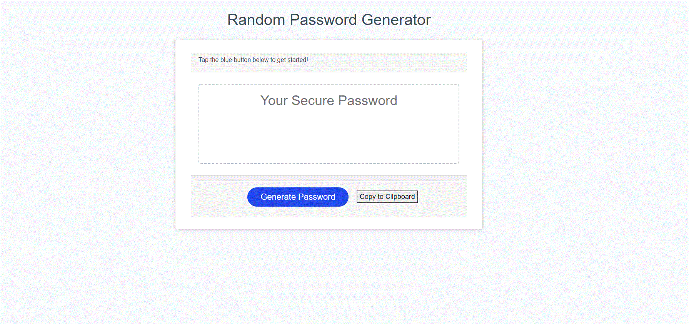

# that-password-generator
Passwords are a real security threat. 
This project seeks to deliver an application that generates a random password based on user selected criteria.  

This app will run in the given browser and features HTML and CSS powered by JavaScript code.
It is designed to feature a clean and polished user interface and be responsive, ensuring that it adapts to multiple screen sizes.

As an added feature, I added the ability to copy the generated password to the clipboard. In addition, I worked to ensure the user is prompted with proper error handling messages if the user did not respond within the applicable required parameters. 

## Preview

## Deployed Site Link
Here's the link to my app:  https://jen6one9.github.io/that-password-generator/

## Acknowledgements
This successful launch of this application was made possible through the support of my tutor and cohort peers. 

## License 
Copyright 20202 Jeneth Diesta

Permission is hereby granted, free of charge, to any person obtaining a copy of this software and associated documentation files (the "Software"), to deal in the Software without restriction, including without limitation the rights to use, copy, modify, merge, publish, distribute, sublicense, and/or sell copies of the Software, and to permit persons to whom the Software is furnished to do so, subject to the following conditions:

The above copyright notice and this permission notice shall be included in all copies or substantial portions of the Software.

THE SOFTWARE IS PROVIDED "AS IS", WITHOUT WARRANTY OF ANY KIND, EXPRESS OR IMPLIED, INCLUDING BUT NOT LIMITED TO THE WARRANTIES OF MERCHANTABILITY, FITNESS FOR A PARTICULAR PURPOSE AND NONINFRINGEMENT. IN NO EVENT SHALL THE AUTHORS OR COPYRIGHT HOLDERS BE LIABLE FOR ANY CLAIM, DAMAGES OR OTHER LIABILITY, WHETHER IN AN ACTION OF CONTRACT, TORT OR OTHERWISE, ARISING FROM, OUT OF OR IN CONNECTION WITH THE SOFTWARE OR THE USE OR OTHER DEALINGS IN THE SOFTWARE.